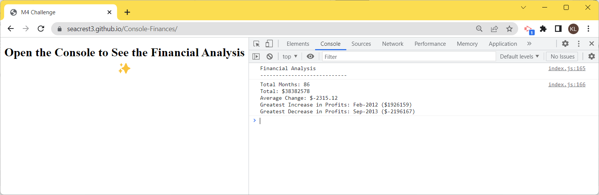

# Console-Finances
Unit 4 Challenge: Create code for analyzing the financial records of a company

## Description

Given a financial dataset, it is required to create code for analyzing the financial records of a company using Javascript.

### User Story

AS A web developer, I WANT to practice my Javascript skills by analyzing a financial dataset using Javascript to produce the financial records of a company.

### Acceptance Criteria

Here are the critical requirements necessary in the financial analysis:

1. Create a new GitHub repo called `Console-Finances`. Then, clone it to your computer.

2. Copy the starter files in your local git repository.
   
You have been given a dataset composed of arrays with two fields, Date and Profit/Losses.

Your task is to write JavaScript code that analyzes the records to calculate each of the following:

* The total number of months included in the dataset.

* The net total amount of Profit/Losses over the entire period.

* The average of the **changes** in Profit/Losses over the entire period.
  * You will need to track what the total change in profits are from month to month and then find the average.
  * (`Total/Number of months`)

* The greatest increase in profits (date and amount) over the entire period.

* The greatest decrease in losses (date and amount) over the entire period.

When you open your code in the browser your resulting analysis should look similar to the following:

  ```text
  Financial Analysis
  ----------------------------
  Total Months: 25
  Total: $2561231
  Average  Change: $-2315.12
  Greatest Increase in Profits: Feb-2012 ($1926159)
  Greatest Decrease in Profits: Sep-2013 ($-2196167)
  ```

Your final code should print the analysis to the console.

### Mock up

The following image shows the results of the financial analysis:



### Review

TA, a Web Developer, reviews the code, providing feedback on errors and making sure that all of the acceptance criteria have been met.

* [The URL of the deployed application.](https://seacrest3.github.io/Console-Finances/)

* [The URL of the GitHub repository.](https://github.com/seacrest3/Console-Finances.git)

### Helpful Resources

- [MDN Javascript Documentation](https://developer.mozilla.org/en-US/docs/Web/JavaScript/)

- [W3Schools Javascript](https://www.w3schools.com/js/)

- [JavaScript Tutorial](https://www.javascripttutorial.net/)

- [Github Pages Guide](https://pages.github.com/)
